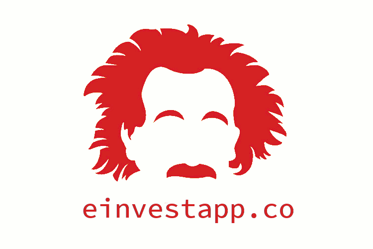

# :chart_with_upwards_trend:einvest.co

>Escrow your Ethereum with us and we will invest in the Indian Stock Market using our Gnosis based Prediction Market

---

&nbsp;

## Demo Video

## Inspiration

Our solution provides an open and novel way to organize investment funds for the future. We wanted to create a revolutionary FinTech product powered by Blockchain Technologies which would allow the user to know the actual performance of the portfolio along with how the analysts hired by the fund performs. With the ethereum smart contract in place for the Escrowed funds, the user can withdraw his amount any time he wishes to do so. Alongside that, the prediction market enables us to actively monitor and reward analysts directly and proportional to their performance.

## What it does

Escrow your Ethereum with us and we will invest in the Indian Stock Market using our Gnosis based Prediction Market that is run by our team of Expert Analysts.

### Flow

1. User escrows his Ethereum with us using a Smart Contract and Dapp written by us.
2. We utilize our prediction markets powered by Gnosis to get the current sentiment regarding Bullish/Bearish behavior of our Expert Analysts who participate in our prediction market in lieu of reward of ethereum. 
3. This provides our decision making business logic algorithm the parameters to place realtime execution sell/purchase orders using Kite API.
4. User can withdraw his ethereum that he has escrowed any time at a rate decided by the NAV at the time it was deposited vs now.

## How we built it

- First we setup the Gnosis Dev Kit provided by the Gnosis team. 
- We built our own API layer to set up prediction markets on the fly on the platform on the Gnosis Management Platform
- Then we integrated the Kite Connect API within our API to enable us to place real time execution orders for purchasing and selling stocks on National Stock Exchange (Indian Stock Market). 
- We added Coinbase api to our platform for obtaining the exchange rate between Ethereum and Indian Rupees.
- After this we wrote our main business logic algorithm which decides to purchase/sell stocks listed on our prediction market based on the current sentiment of our Analyst team using the integration of Kite API.
- The platform transactions happen through the Metamask chrome extension page seamlessly on the testrpc as well as Ropsten Test Exchange.

## Challenges we ran into

- This was our first Blockchain based event and we had to rely on reading a lot of documentation (often incomplete / deprecated due to the fast pace of this tech)
- We constantly battled between the fundamental differences between web apps and Dapps.

## Accomplishments that we're proud of
- We were able to integrate a lot of APIs in time along with our business logic.
- Complete a project on something that is cutting edge.
